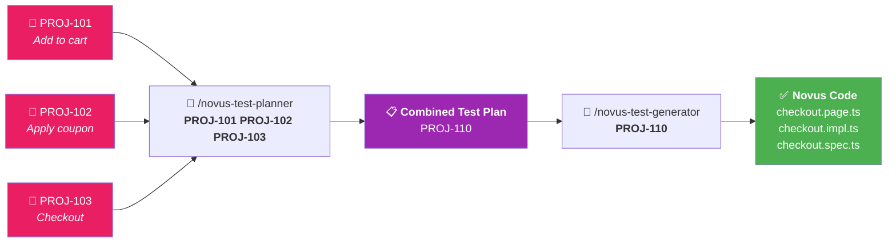
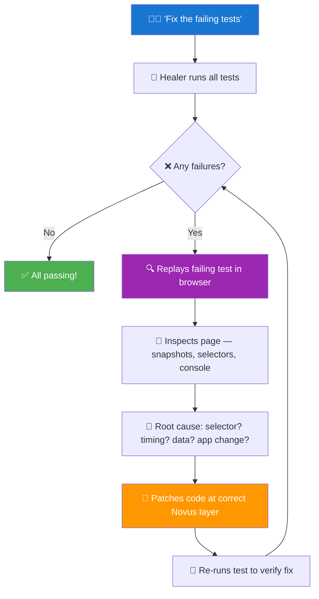
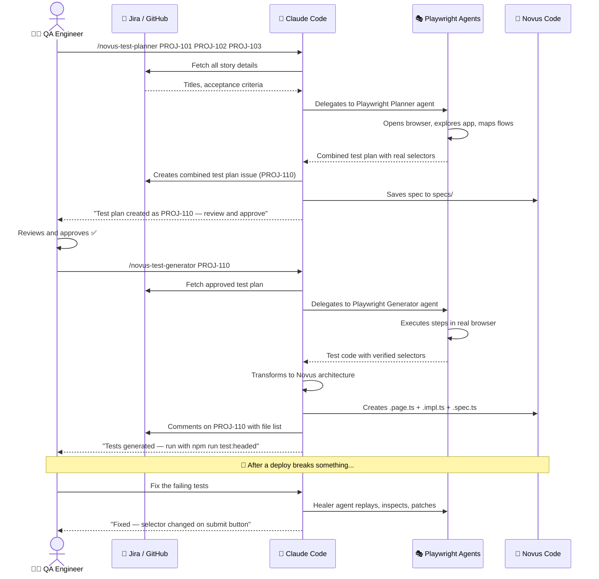
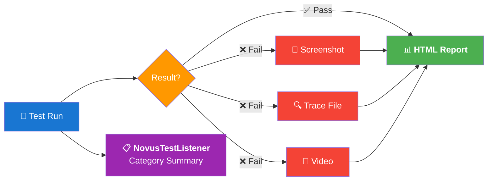
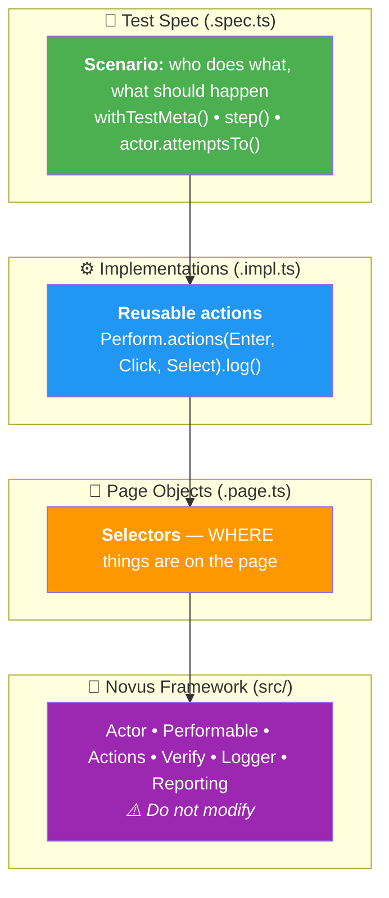

<p align="center">
  <picture>
    <source media="(prefers-color-scheme: dark)" srcset="https://img.shields.io/badge/🔥_NOVUS-Test_Automation_Framework-blue?style=for-the-badge&labelColor=1a1a2e&color=e94560">
    
  </picture>
</p>

<p align="center">
  <strong><em>Novus is a latin word that means new, fresh, young and extraordinary.</em></strong>
</p>

<p align="center">
  Write <strong>super stable</strong>, <strong>high quality</strong> automated acceptance tests<br/>
  using a <strong>fluent DSL</strong> that reads like plain English.
</p>

<p align="center">
  
  
  
  
</p>

<p align="center">
  
  
</p>

<p align="center">
  <a href="https://playwright.dev/docs/test-agents"><strong>Playwright Test Agents</strong></a> &bull;
  <a href="https://github.com/3PillarGlobal/novus"><strong>Java Novus (Original)</strong></a> &bull;
  <a href="#-qa-workflow--how-you-use-this"><strong>QA Workflow</strong></a> &bull;
  <a href="#-getting-started"><strong>Get Started</strong></a>
</p>

---

<table>
<tr>
<td width="50%">

### The Novus Style

```typescript
await actor.attemptsTo(
  Launch.app(on(urlService.getAppUrl())),
  Navigate.to().contactPage(),
  fillFirstName("Test"),
  fillLastName("User"),
  fillCompanyName("Test Company"),
  fillBizEmail("client@abc.com"),
  selectState("Alabama"),
  fillClientMessage("Hi, I'd like to learn more")
);
```

</td>
<td width="50%">

### What Makes It Different

🎯 **Fluent DSL** — tests read like plain English<br/>
🧱 **Screenplay Pattern** — layered, maintainable architecture<br/>
🎭 **Playwright Agents** — AI plans, generates, and heals tests<br/>
🤖 **Claude Code Ready** — `/novus-test-planner` from Jira/GitHub issues<br/>
🔄 **Java Novus Parity** — exact same patterns, now in TypeScript<br/>
📊 **Built-in Reporting** — screenshots, traces, category summaries

</td>
</tr>
</table>

---

> [!IMPORTANT]
> ### 🤖 With AI or Without — Novus Works Both Ways
>
> | Mode | How it works | Who it's for |
> |------|-------------|-------------|
> | **With AI** (Claude Code + Playwright MCP) | Use `/novus-test-planner` and `/novus-test-generator` — AI reads your Jira/GitHub issues, explores your app in a real browser, and generates Novus-standard test code automatically | QA teams using [Claude Code](https://claude.ai/claude-code) with [Playwright Test Agents](https://playwright.dev/docs/test-agents) |
> | **Without AI** (manual) | Write page objects, implementations, and test specs by hand following the Novus patterns in this README | QA teams who prefer manual coding or don't have AI tooling |
>
> **The framework is the same either way.** AI just generates the code faster — the output follows the exact same architecture, patterns, and conventions that a human would write by hand.

---

## 📑 Table of Contents

| Section | What you'll find |
|---------|-----------------|
| [🔄 QA Workflow](#-qa-workflow--how-you-use-this) | **Start here** — single story, multi-story batch, healing flows |
| [🚀 Getting Started](#-getting-started) | Prerequisites, installation, environment config |
| [🤖 AI-Accelerated Testing](#-ai-accelerated-testing) | End-to-end flow diagram, commands, what powers this |
| [🔌 Using in Existing Repo](#-using-novus-in-an-existing-repo) | Copy list, no-conflict guide |
| [▶️ Running Tests](#%EF%B8%8F-running-tests) | All run commands with descriptions |
| [📊 Reports & Artifacts](#-reports-and-artifacts) | What gets generated, where, when |
| **Appendix** | |
| [A. 🏗️ Architecture](#a-%EF%B8%8F-architecture) | Screenplay pattern, layer diagram, Java-to-TS mapping |
| [B. ✍️ Code Examples](#b-%EF%B8%8F-the-novus-style--code-examples) | Full test + implementation examples |
| [C. 📋 Writing Tests](#c--writing-tests--gui-api-custom-actions) | GUI, API, custom action patterns |
| [D. 📚 Actions Reference](#d--available-actions-reference) | Complete UI, verification, and API method tables |
| [E. 📁 Project Structure](#e--project-structure) | Full directory tree |
| [F. 🛠️ Technology Stack](#f-%EF%B8%8F-technology-stack) | Tools and their purpose |

---

## 🔄 QA Workflow — How You Use This

### 📌 Single Story

> **You have a Jira/GitHub story. You want tests. Here's what you do:**

| Step | You do | What happens |
|:----:|--------|-------------|
| **1** | Have a feature story — e.g. `PROJ-123` | — |
| **2** | `/novus-test-planner PROJ-123` | Claude fetches the story, **Playwright Planner agent** explores your app in a real browser, creates a test plan |
| **3** | Claude creates **QA test plan issue** `PROJ-124` in your tracker | Spec also saved to `specs/` |
| **4** | **You review and approve** the test plan | — |
| **5** | `/novus-test-generator PROJ-124` | **Playwright Generator agent** executes steps in browser, Claude transforms output to **Novus architecture** |
| **6** | Claude generates `.page.ts` + `.impl.ts` + `.spec.ts` | Comments on `PROJ-124` with file list |
| **7** | `npm run test:headed` | **Watch your tests run** in the browser |

### 📌 Multiple Stories (Batch Planning)

> **In real projects, a single testable feature often spans multiple stories.** QA can't test story 1.1 in isolation — they need 1.1 + 1.2 + 1.3 together to have a complete flow.

| Step | You do | What happens |
|:----:|--------|-------------|
| **1** | Have related stories — `PROJ-101`, `PROJ-102`, `PROJ-103` | — |
| **2** | `/novus-test-planner PROJ-101 PROJ-102 PROJ-103` | Claude fetches **all three**, understands the combined flow |
| **3** | Claude creates **ONE combined test plan** issue `PROJ-110` | Covers the full feature, not individual stories |
| **4** | **You review and approve** | — |
| **5** | `/novus-test-generator PROJ-110` | Generates **one cohesive test suite** — shared page objects, shared impls |
| **6** | All source stories (`PROJ-101`, `102`, `103`) linked in test metadata `stories[]` | Full traceability |



### 🔧 Healing Broken Tests

> **After a deploy breaks tests, just ask Claude. No command needed** — the Playwright Healer agent is an official agent that runs automatically.

| Step | What happens |
|:----:|-------------|
| **1** | You say: **"Fix the failing tests"** |
| **2** | Healer agent runs **all tests** via `test_run` tool to identify failures |
| **3** | For each failing test, Healer calls `test_debug` — **replays the test step-by-step** in a real browser |
| **4** | When a step fails, Healer **inspects the page** — takes a snapshot, examines current selectors, checks console errors |
| **5** | Healer performs **root cause analysis**: selector changed? timing issue? data dependency? app behavior changed? |
| **6** | Healer **patches the code** at the correct Novus layer — page object for selectors, impl for waits/logic |
| **7** | Healer **re-runs the test** to verify the fix works |
| **8** | Repeats steps 3–7 for each failure **until all tests pass** or marks unfixable tests as `test.fixme()` with a comment explaining why |



> 💡 **Where does the Healer fix things?**
>
> | Problem found | Fixed in | Example |
> |---|---|---|
> | Selector changed | **`tests/pages/*.page.ts`** | `#checkout-btn` → `#place-order` |
> | Element needs a wait | **`tests/impls/*.impl.ts`** | Adds `.byWaitingFor(2)` or `Waiting.on()` |
> | Assertion value changed | **`tests/example/*.spec.ts`** | Updates expected text/URL |
> | Permanently broken | Marks as **`test.fixme()`** | Adds comment explaining what's different |

---

## 🚀 Getting Started

### Prerequisites

| Requirement | Version | Download |
|---|---|---|
| **Node.js** | `18+` | [nodejs.org](https://nodejs.org/) |
| **npm** | `9+` | Comes with Node.js |
| **Git** | Latest | [git-scm.com](https://git-scm.com/) |

### Installation

```bash
# 1️⃣  Clone and install
git clone <repo-url>
cd novus-typescript
npm install

# 2️⃣  Install Playwright browsers
npm run setup

# 3️⃣  Configure your application URL
cp .env.example .env
# ✏️ Edit .env — set AUT_PROTOCOL, AUT_DOMAIN, AUT_BASE_URL

# 4️⃣  Initialize Playwright Test Agents
npx playwright init-agents --loop=claude

# 5️⃣  Verify setup
npm test
```

> [!TIP]
> **First time?** Just run **`/novus-start`** in Claude Code — it does all of the above interactively. No need to remember the commands.

### ⚙️ Environment Configuration

> Copy `.env.example` → `.env` and set these for **your** application:

| Variable | Default | Description |
|----------|---------|-------------|
| **`AUT_PROTOCOL`** | `https://` | Application protocol |
| **`AUT_DOMAIN`** | `www.3pillarglobal.com` | Application domain |
| **`AUT_BASE_URL`** | `https://www.3pillarglobal.com` | Full base URL _(used by Playwright)_ |
| **`HEADLESS`** | `true` | Set **`false`** to watch the browser |
| **`BROWSER_WIDTH`** | `1620` | Viewport width in px |
| **`BROWSER_HEIGHT`** | `1080` | Viewport height in px |
| **`SLOW_MO`** | `100` | Delay between actions _(ms, useful for debugging)_ |

---

## 🤖 AI-Accelerated Testing

Novus uses [**Playwright Test Agents**](https://playwright.dev/docs/test-agents) for real browser work and **Novus commands** as bridges to your issue tracker.

### 🔄 End-to-End Flow



### 📋 Novus Commands

> All prefixed with **`novus-`** to avoid conflicts in repos with existing `.claude/` folders.

| Command | Input | Output |
|---------|-------|--------|
| 🏁 **`/novus-start`** | — | First-time setup: deps, URL, agents |
| 📋 **`/novus-test-planner`** | **One or more** story issues | Combined QA test plan issue + `specs/<key>.md` |
| ⚡ **`/novus-test-generator`** | Approved test plan issue | Novus code: `.page.ts` + `.impl.ts` + `.spec.ts` |
| 🔧 **Healer** | _Just ask Claude "fix failing tests"_ | **Runs automatically** — no command needed |

### 🧩 What Powers This

| Component | Role |
|---|---|
| 🎭 [**Playwright Test Agents**](https://playwright.dev/docs/test-agents) | **Planner** explores app in real browser, **Generator** creates tests by executing steps, **Healer** debugs failures — _all official Playwright_ |
| 🎯 **`tests/seed.spec.ts`** | Teaches Playwright agents **Novus conventions** — Actor, `withTestMeta()`, `step()`, `Perform.actions().log()` |
| 📜 **`CLAUDE.md`** | Novus architecture rules — ensures **all AI-generated code** follows the framework |
| 🔌 **`.claude/commands/novus-*.md`** | Bridges between **issue tracker** and Playwright agents |

---

## 🔌 Using Novus in an Existing Repo

> Commands are namespaced with **`novus-`** — **no conflicts** with existing `.claude/` folders.

**✅ Copy to your repo:**
| File | Destination |
|------|-------------|
| `.claude/commands/novus-*.md` | Your repo's `.claude/commands/` |
| `CLAUDE.md` | Repo root _(or merge into existing)_ |
| `tests/seed.spec.ts` | Your `tests/` folder |
| `specs/` | Repo root |

**🔄 Regenerate per-repo** _(don't copy)_:
```bash
npx playwright init-agents --loop=claude   # creates .claude/agents/ + .mcp.json
```

**🚫 Never copy** _(repo-specific)_:
| File | Why |
|------|-----|
| `.claude/settings.local.json` | User-specific settings |
| `.mcp.json` | Regenerated by `init-agents` |
| `.env` | Your app's URL and config |

---

## ▶️ Running Tests

| Command | What it does |
|---------|-------------|
| `npm test` | 🧪 Run **all** tests |
| `npm run test:headed` | 👁️ Run with **browser visible** |
| `npm run test:debug` | 🐛 **Step-by-step** debug mode |
| `npm run test:ui` | 🖥️ Playwright **UI picker** |
| `npx playwright test tests/example/basic-api.spec.ts` | 📄 Run a **specific file** |
| `npx playwright test --grep "testClientWritingToUs"` | 🔍 Run by **test name** |
| `npx playwright test --project chromium` | 🌐 Run in a **specific browser** |
| `npm run report` | 📊 Open **HTML report** |
| `npm run typecheck` | ✅ **Type check** only (no test run) |

---

## 📊 Reports and Artifacts



| Artifact | Location | When generated |
|----------|----------|----------------|
| 📊 **HTML Report** | `tests/resources/reports/` | Every test run |
| 📸 **Screenshots** | `tests/resources/screenshots/` | **On failure only** |
| 🔍 **Trace files** | `tests/resources/screenshots/` | On first retry |
| 🎥 **Video** | `tests/resources/screenshots/` | Retained on failure |
| 📋 **Category summary** | Console output | Every run _(from NovusTestListener)_ |

```bash
npm run report   # 📊 Open the HTML report in your browser
```

---

## 📖 How-To Guides

| Guide | What you'll learn |
|-------|-------------------|
| 📌 [**Conditional Actions**](tests/resources/HowTo/Conditional-Actions.md) | Perform actions **only when** a locator is present |
| 🔄 [**Retry Actions**](tests/resources/HowTo/Retry-Actions.md) | Retry flaky actions with **exception handling** |
| 🖱️ [**Click Action Usage**](tests/resources/HowTo/Use-Click-Action.md) | Advanced click — **frames, waits, multi-click, fallbacks** |

---

# Appendix

## A. 🏗️ Architecture

Novus follows the **Screenplay Pattern** — separates _what_ is tested from _how_ it is tested.



> 📌 **Selector changes** → fix **Page Object** only.
> **Workflow changes** → fix **Implementation** only.
> **Test specs rarely need changes** — that's the power of layered architecture.

### Module Mapping (Java Novus → TypeScript Novus)

| Java Module | TypeScript Module | Contains |
|---|---|---|
| **`novus-core`** | **`src/core/`** | Actor, Performable, Waiter, Verifiable, Logger, Reporting, Retry, LocalCache, Exceptions, CodeFillers, CredentialsGenerator, DateTimeUtility, NovusHardAssert, NovusSoftAssert |
| **`novus-core-ui`** | **`src/ui/`** | Click, Enter, Type, Select, Clear, Retrieve, Launch, Open, Close, Perform, Waiting, Alert, CheckBox, DoubleClick, Keyboard, BrowserRefresh, Verify, SoftlyVerify, LocateBy, BrowserConfig |
| **`novus-core-api`** | **`src/api/`** | Get, Post, Put, Delete, ApiCore, ApiDriver, ApiConfig, JsonUtil |
| **`novus-example-tests`** | **`tests/`** | Pages, Impls, Macros, Services, Constants, Listeners, Example Tests |

---

## B. ✍️ The Novus Style — Code Examples

> In Novus, **only an Actor** performs actions. The DSL reads like English.

### Test Example

```typescript
test("testClientWritingToUs", async ({ actor }) => {
    withTestMeta({
      author: "Sidhant Satapathy",
      scenario: "Test Lets Talk functionality on the Contact Page",
      outcome: "Verify that the clients can write to us with all the details successfully",
      testCaseId: "1",
      category: "TPG_CONTACT_US",
      stories: ["JIRA-1234", "JIRA-1245"],
    });

    step("Client launches 3pillar website");
    await actor.attemptsTo(Launch.app(on(urlService.getAppUrl())));

    await actor.wantsTo(
      Verify.uiElement(HomePage.CONTACT_LINK)
        .describedAs("contact link is displayed").isVisible()
    );

    step('Client goes to the "Contact" page');
    await actor.attemptsTo(
        Navigate.to().contactPage(),
        fillFirstName("Test"),
        fillLastName("User"),
        fillCompanyName("Test Company"),
        fillBizEmail("client@abc.com"),
        fillBizPhoneNumber("1234567890"),
        fillJobTitle("job title"),
        selectState("Alabama"),
        fillClientMessage("Hi I am testing the Lets Talk Section")
    );
});
```

### Implementation Example

> **Every** action function **must** wrap in `Perform.actions().log()`:

```typescript
export function fillFirstName(fName: string): Performable {
    return Perform.actions(
      Enter.text(fName).on(ContactPage.LetsTalk.FIRST_NAME).inFrame(FRAME)
    ).log("fillFirstName", "fills the first name of the client");
}
```

---

## C. 📋 Writing Tests — GUI, API, Custom Actions

### 🖥️ GUI Tests — use `test` from **NovusGuiTestBase**

| Fixture | Type | Description |
|---------|------|-------------|
| **`actor`** | `Actor` | Pre-wired with `Page` + `BrowserContext` |
| **`softly`** | `NovusSoftAssert` | Soft assertions — collected, **thrown at test end** |
| **`novusReport`** | `NovusReportingService` | Metadata, steps, screenshots |

```typescript
import { test, withTestMeta, step } from "../../src/ui/novus-gui-test-base";

test.describe("Feature", () => {
  test("scenario", async ({ actor }) => {
    withTestMeta({ author: "QA", scenario: "...", outcome: "...", testCaseId: "TC-1", category: "CAT" });
    step("Do something");
    await actor.attemptsTo(/* actions */);
    step("Verify");
    await actor.wantsTo(Verify.uiElement(sel).isVisible());
  });
});
```

### 🌐 API Tests — use `apiTest` from **NovusApiTestBase**

```typescript
import { apiTest } from "../../src/api/novus-api-test-base";
import { Get } from "../../src/api/methods/get";

apiTest.describe("API", () => {
  apiTest("getTest", async ({ apiContext }) => {
    const response = await Get.using(apiContext).atUrl("url").execute();
    response.isOk();
  });
});
```

### 🧩 Custom Actions — implement **`Performable`**

```typescript
export class ScrollToBottom implements Performable {
  static now(): ScrollToBottom { return new ScrollToBottom(); }
  async performAs(actor: Actor): Promise<void> {
    await actor.usesBrowser().evaluate(() => window.scrollTo(0, document.body.scrollHeight));
  }
}
// Usage: await actor.attemptsTo(ScrollToBottom.now());
```

---

## D. 📚 Available Actions Reference

### 🖱️ UI Actions

| Action | Factory | Key Options |
|--------|---------|-------------|
| **Launch** | `Launch.app(url)` | `.withConfigs("load" \| "domcontentloaded" \| "networkidle")` |
| **Click** | `Click.on(sel)` | `.nth(i)` `.last()` `.ifDisplayed()` `.ifNotDisplayed()` `.orElse(...)` `.multipleTimes()` `.inFrame(f)` `.afterWaiting(...)` `.laterWaiting(...)` `.until(sel)` `.retryUpTo(n)` `.accept(sel)` `.byWaitingFor(sec)` |
| **Enter** | `Enter.text(val).on(sel)` | `.nth(i)` `.multi()` `.ifDisplayed()` `.inFrame(f)` `.after(...)` `.byWaitingFor(sec)` |
| **Type** | `Type.text(val).on(sel)` | `.withDelay()` `.afterWaiting(...)` `.byWaitingFor(sec)` |
| **Select** | `Select.option(val).on(sel)` | `.inFrame(f)` |
| **Clear** | `Clear.locator(sel)` | |
| **DoubleClick** | `DoubleClick.on(sel)` | |
| **CheckBox** | `CheckBox.check(sel)` / `.uncheck(sel)` | |
| **Keyboard** | `Keyboard.press(key)` | `.on(sel)` `.times(n)` |
| **BrowserRefresh** | `BrowserRefresh.refreshBrowser()` | `.times(n)` `.checking(sel)` |
| **Alert** | `Alert.accept()` / `.dismiss()` | |
| **Open** | `Open.aNewBrowser()` | |
| **Close** | `Close.browser()` | |
| **Retrieve** | `Retrieve.text().ofLocator(sel)` | `.getAs(actor)` → `string`. Also: `.attribute()` `.value()` `.href()` `.inputValue()` `.ifChecked()` `.count()` `.currentUrl()` |
| **Waiting** | `Waiting.on(sel)` | `.seconds(n)` `.toBe(state)` `.withState(state)` `.within(sec)` `.nth(i)` |
| **Perform** | `Perform.actions(...)` | `.log(method, desc)` `.iff(sel)` `.twice()` `.thrice()` `.times(n)` `.ifExceptionOccurs(...)` `.then(...)` `.meanwhile(fn)` `.byWaitingFor(sec)` |

### ✅ Verification

| Method | Description |
|---|---|
| `Verify.uiElement(sel).isVisible()` / `.isNotVisible()` | Visibility |
| `.containsText(t)` / `.doesNotContainText(t)` / `.hasText(t)` | Text content |
| `.isEnabled()` / `.isDisabled()` | Enabled state |
| `.hasId(v)` / `.hasClass(v)` / `.hasCSS(p,v)` / `.hasAttribute(n,v)` | Attributes |
| `.hasValue(v)` / `.isChecked()` / `.isEditable()` / `.isEmpty()` / `.isFocused()` | Input state |
| `.hasCount(n)` / `.hasJSProperty(n,v)` | Count / JS property |
| `Verify.page().title(t)` | Page title _(regex)_ |
| `Verify.url().is(u)` / `.contains(t)` | URL assertions |
| `Verify.verify(actual, expected).describedAs(msg)` | Object-level assertion |

> 💡 All verifications support **`.describedAs("msg")`** and **`.byWaitingFor(seconds)`**.

### 🌐 API Methods

| Method | Factory | Options |
|--------|---------|---------|
| **GET** | `Get.using(ctx).atUrl(url)` | `.execute()` |
| **POST** | `Post.using(ctx).atUrl(url)` | `.jsonBody({})` `.withBody()` `.withFormData({})` `.withBinary(path)` `.execute()` |
| **PUT** | `Put.using(ctx).atUrl(url)` | `.jsonBody({})` `.withBody()` `.execute()` |
| **DELETE** | `Delete.using(ctx).atUrl(url)` | `.execute()` |

> **Shared options:** `.withHeader(k,v)` `.withParam(k,v)` `.withBasicAuth(u,p)`
>
> **Assertions:** `.isOk()` `.isNotOk()` `.statusCodeMatches(code)` `.bodyContains(text)`
>
> **Response data:** `.mapToObject<T>()` `.mapToList<T>()` `.getContent()` `.getBody()` `.printResponse()`

---

## E. 📁 Project Structure

```
novus-typescript/
├── 🔧 src/                          # Framework core — ⚠️ DO NOT MODIFY
│   ├── core/                        #   Actor, Performable, Logger, Reporting, Retry, Exceptions
│   ├── ui/                          #   Click, Enter, Type, Select, Verify, Perform, Launch, Waiting...
│   └── api/                         #   Get, Post, Put, Delete, ApiCore, ApiDriver
├── 🧪 tests/                        # ✏️ YOUR TEST CODE GOES HERE
│   ├── pages/                       #   Page objects (selectors)
│   ├── impls/                       #   Implementations (Perform.actions().log())
│   ├── macros/                      #   Navigation macros
│   ├── services/                    #   UrlService
│   ├── constants/                   #   TestGroups
│   ├── listeners/                   #   NovusTestListener
│   ├── example/                     #   Test spec files
│   ├── seed.spec.ts                 #   🎭 Teaches Playwright agents Novus conventions
│   ├── global-setup.ts              #   Runs before all tests
│   ├── global-teardown.ts           #   Runs after all tests
│   └── resources/                   #   📸 Screenshots, 📊 Reports, 📖 HowTo guides
├── 📋 specs/                        # Test plan specs (from Planner agent)
├── 🤖 .claude/commands/             # Novus bridge commands (novus-* prefixed)
├── 🎭 .claude/agents/               # Playwright Test Agents (from init-agents)
├── 📜 CLAUDE.md                     # AI rulebook — Novus patterns
├── 🎭 playwright.config.ts          # Playwright config
├── ⚙️ .env.example                  # Environment template
└── 📦 package.json                  # Dependencies and scripts
```

---

## F. 🛠️ Technology Stack

| Component | Technology | Purpose |
|---|---|---|
| 🎭 **Test Runner** | [Playwright Test](https://playwright.dev/) | Browser automation, API testing, parallel execution |
| 🤖 **AI Agents** | [Playwright Test Agents](https://playwright.dev/docs/test-agents) | Planner, Generator, Healer — real browser AI |
| 📘 **Language** | [TypeScript](https://www.typescriptlang.org/) | Type safety, IDE autocompletion |
| 🎲 **Test Data** | [Faker.js](https://fakerjs.dev/) | Random test data generation |
| 📊 **Reporting** | HTML Reporter + NovusTestListener | Reports with screenshots, traces, category summaries |
| 🔄 **CI/CD** | GitHub Actions | Type check + test on push/PR |
| 🔒 **Pre-commit** | Husky + lint-staged | Type check before commit |

---

## 🤝 Contributing

Please check the [contributing rules](CONTRIBUTING.md) before submitting changes.
